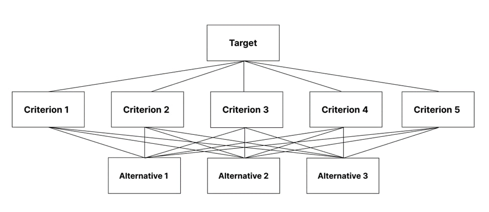
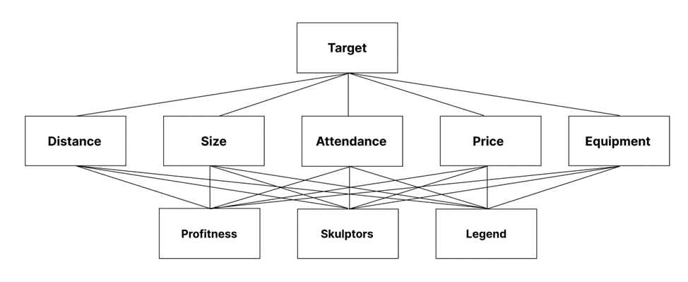
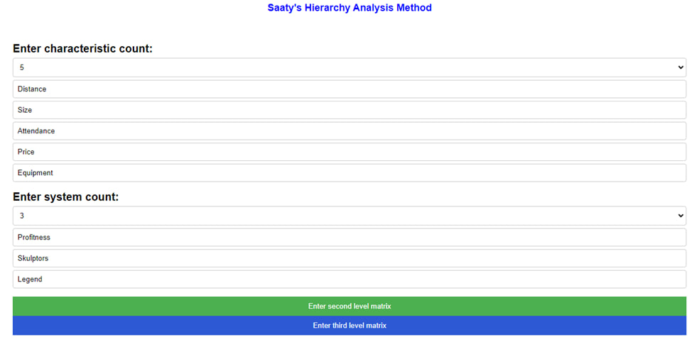
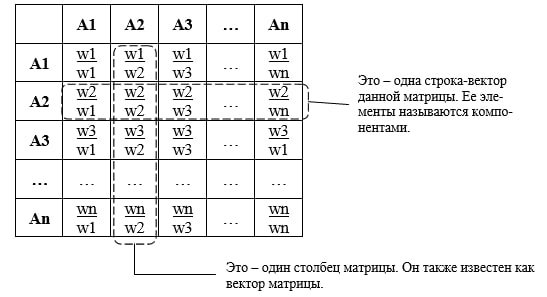
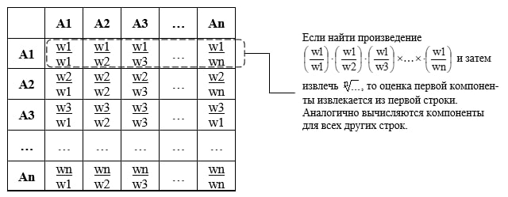
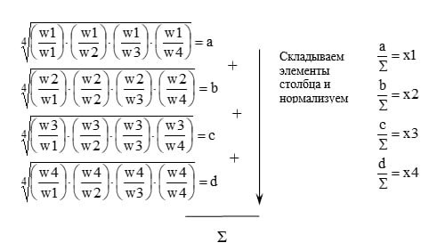
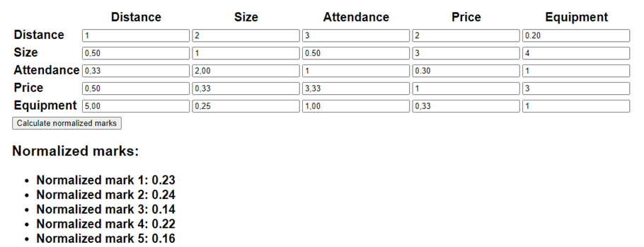
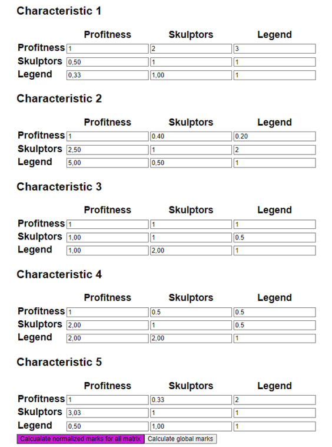
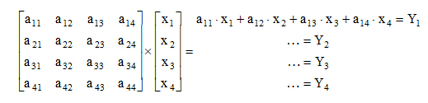
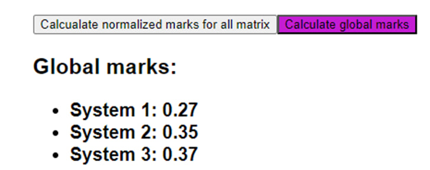

### Метод анализа иерархий Саати
Метод анализа иерархий, разработанный Томасом Саати, представляет собой математический инструмент для систематического сравнения и оценки альтернативных вариантов по их относительной значимости в иерархической структуре целей или критериев. Этот метод базируется на принципе парных сравнений, где эксперты оценивают относительную важность каждой пары альтернатив, что затем позволяет выявить иерархию приоритетов и принять обоснованные решения
Рассмотрим методику применения анализа иерархий. Процесс работы с моделью начинается с создания иерархической структуры, которая включает в себя цели, основные критерии и альтернативы

На верхнем уровне представлена цель, которая подвергается воздействию ряда критериев, размещенных на следующем уровне иерархии. Каждый из этих критериев обладает собственными характеристиками, оцениваемыми количественно. Коллективное взаимодействие этих критериев в процессе моделирования порождает несколько альтернатив, из которых по итогу выбирается наиболее подходящее.

## Пример
Человек хочет приобрести абонемент в фитнес клуб и определяет наиболее значимые критерии клуба:

1) Удаленность 
2) Размер 
3) Посещаемость
4) Цена
5) Оборудование

И также кандидатов

1) Профитнес
2) Скульпторс
3) Легенда

Схема будет выглядеть следующим образом

В самом приложении выбираем необходимое количество систем и характеристик и вводим их названия

После ввода систем и названий необходимо заполнить матрицу попарных сравнений второго уровня.

Это матрица отражающая отношения характеристик (кажадя к каждой) и обладающая свойством обратно симметричной матрицы 

После заполнения матрицы необходимо рассчитать нормализованные оценки 

Рассчеты осуществляются следующим образом:

1) Находим произведение по строке и извлекаем корень из n, где n - количество элементов.
Найденное произведение и будет оценкой  

2) Найденные оценки необходимо нормализовать, для этого находим сумму всех оценок и каждую оценку делим на найденную сумму

После расчета нормализованных оценок для матрицы 2-го уровня, создаем матрицы 3-го уровня, в которых проводим попарное сравнение всех систем по каждой характеристике

Эти матрицы обладают такими же свойствами, как матрица второго уровня и расчеты нормализованных оценок идентичны

Последний этап - расчет глобальных оценок

Столбцы a – транспонированные матрицы, полученные после расчета матриц 3-го уровня, компоненты x – это нормализованные оценки матрицы 2-го уровня.
Глобальные оценки считаются путем перемножения элементов строки с соответствующими компонентами нормализованных оценок матрицы 2-го уровня (х), произведения суммируются и получаются итоговые оценки.

